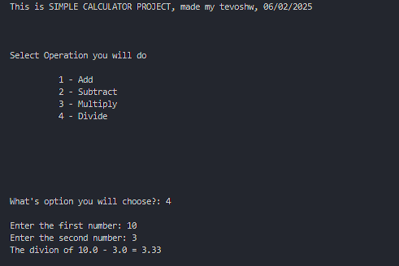

# Simple Calculator CLI

A simple command-line interface (CLI) calculator that performs basic arithmetic operations like addition, subtraction, multiplication, and division.

## Features:
- Add two numbers
- Subtract two numbers
- Multiply two numbers
- Divide two (handles division by zero)

## Output code example



## Usage:
1. Clone the repository.
2. Run the `calculator.py` file.
```bash
python calculator.py

